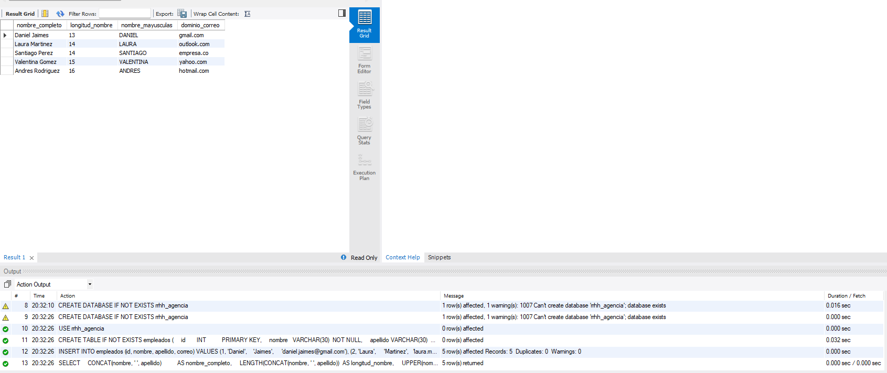

# RRHH Agencia — Transformación de Datos con Funciones SQL

## Información del Estudiante

| Campo | Detalle |
|:---|:---|
| **Nombre completo** | Daniel Eduardo Jaimes Gamboa |
| **Base de datos** | MySQL 8.0.46 |
| **Herramienta** | MySQL Workbench 8.0.47 |

---

## Descripción

Este repositorio contiene los scripts SQL desarrollados para estandarizar la visualización de información personal de empleados en una agencia de recursos humanos. Se aplican funciones de transformación de texto sobre los campos de la tabla `empleados`.

---

## Estructura del Repositorio

```
rrhh-agencia/
├── DDL/
│   └── 01_crear_bd_tabla.sql      # Crea la base de datos y la tabla empleados
├── DML/
│   └── 02_insertar_empleados.sql  # Inserta los 5 empleados de prueba
└── DQL/
    └── 03_consulta_transformaciones.sql  # Consulta con funciones SQL
```

### ¿Qué significa cada carpeta?

- **DDL** (Data Definition Language): Scripts que definen la estructura de la base de datos y las tablas.
- **DML** (Data Manipulation Language): Scripts que insertan, actualizan o eliminan datos.
- **DQL** (Data Query Language): Scripts que consultan y transforman los datos.

---

## Paso a Paso de Ejecución

Ejecutar los archivos en este orden desde MySQL Workbench:

**1. DDL — Crear base de datos y tabla**
```sql
CREATE DATABASE IF NOT EXISTS rrhh_agencia;
USE rrhh_agencia;

CREATE TABLE IF NOT EXISTS empleados (
    id       INT          PRIMARY KEY,
    nombre   VARCHAR(30)  NOT NULL,
    apellido VARCHAR(30)  NOT NULL,
    correo   VARCHAR(50)  NOT NULL
);
```

**2. DML — Insertar empleados**
```sql
USE rrhh_agencia;

INSERT INTO empleados (id, nombre, apellido, correo) VALUES
(1, 'Daniel',    'Jaimes',    'daniel.jaimes@gmail.com'),
(2, 'Laura',     'Martinez',  'laura.martinez@outlook.com'),
(3, 'Santiago',  'Perez',     'santiago.perez@empresa.co'),
(4, 'Valentina', 'Gomez',     'valentina.gomez@yahoo.com'),
(5, 'Andres',    'Rodriguez', 'andres.rodriguez@hotmail.com');
```

**3. DQL — Consulta de transformación**
```sql
USE rrhh_agencia;

SELECT
    CONCAT(nombre, ' ', apellido)          AS nombre_completo,
    LENGTH(CONCAT(nombre, ' ', apellido))  AS longitud_nombre,
    UPPER(nombre)                          AS nombre_mayusculas,
    SUBSTRING_INDEX(correo, '@', -1)       AS dominio_correo
FROM empleados;
```

---

## Funciones SQL Utilizadas

| Función | Descripción | Ejemplo |
|:---|:---|:---|
| `CONCAT()` | Une dos o más cadenas de texto | `Daniel` + ` ` + `Jaimes` = `Daniel Jaimes` |
| `LENGTH()` | Cuenta el número de caracteres | `Daniel Jaimes` → `13` |
| `UPPER()` | Convierte texto a mayúsculas | `Daniel` → `DANIEL` |
| `SUBSTRING_INDEX()` | Extrae parte de un texto según un delimitador | `daniel@gmail.com` → `gmail.com` |

---

## Resultado de la Consulta

| nombre_completo | longitud_nombre | nombre_mayusculas | dominio_correo |
|:---|:---|:---|:---|
| Daniel Jaimes | 13 | DANIEL | gmail.com |
| Laura Martinez | 14 | LAURA | outlook.com |
| Santiago Perez | 14 | SANTIAGO | empresa.co |
| Valentina Gomez | 15 | VALENTINA | yahoo.com |
| Andres Rodriguez | 16 | ANDRES | hotmail.com |

---

## Evidencia


